# Paris 2024 Olympics

The Paris 2024 Olympics featured an exciting opening ceremony with athletes parading on boats along the Seine River. The Games feature over 300 events, including swimming, basketball, tennis, gymnastics, and track. Notable athletes include Leon Marchand, Teddy Riner, Simone Biles, and Katie Ledecky. The Australian team excelled in various events, with notable achievements in swimming, athletics, and cycling.

## The wet & long opening ceremony

What's unique with the opening ceremony is it was done along the Seine river where the athletes are on boats passing by. The problem is because of too many moving parts, the only way to maintain the script or story line is through the big screens.
> Australia & France teams passing our location where we were standing for 5 hours, wet with loud speakers & a distant big screen. It was a different kind of experience compared to Sydney 2000.
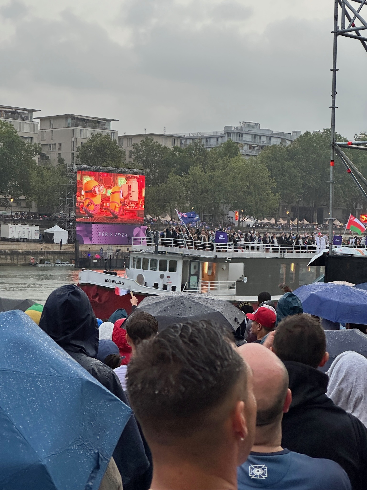
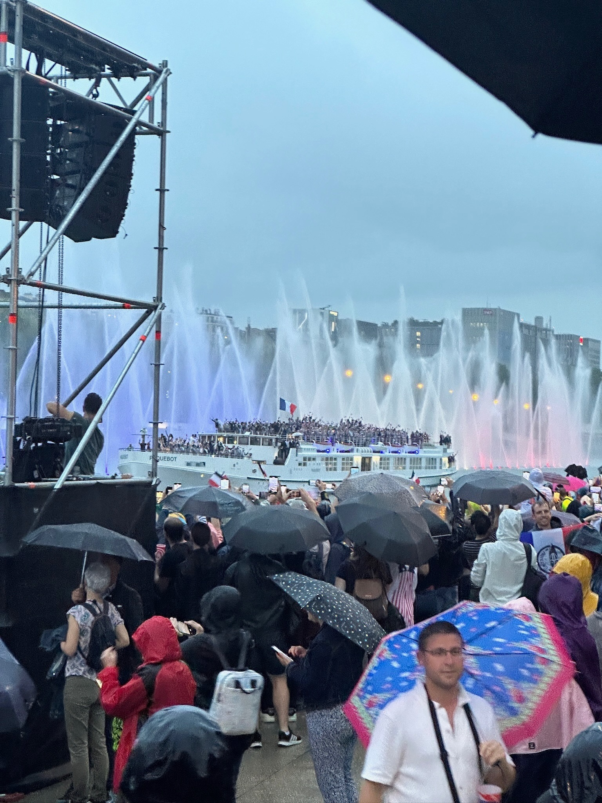

## Where's Lady Gaga?

The show is a consolidation of live, pre-recorded acts as well as multimedia sequenced to show France's culture, fashion & lifestyle which was smartly connected & presented in big screens along the river.
> These stairs that we saw was empty but Gaga was singing & dancing on them in the big screens at that same time :(
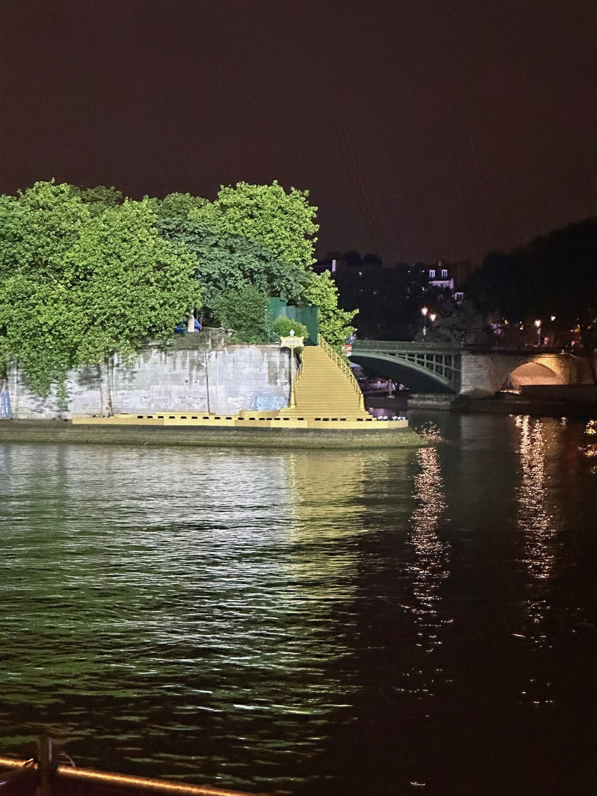

## Events we watched

Overall the olympics was organised but not many volunteers compared to Sydney and because the French love their language so much there were no subtitles in the pre-opening talks.
> The beach volleyball was done very near the Tower, while the badminton & hockey, we have to ride trains to go to the venues
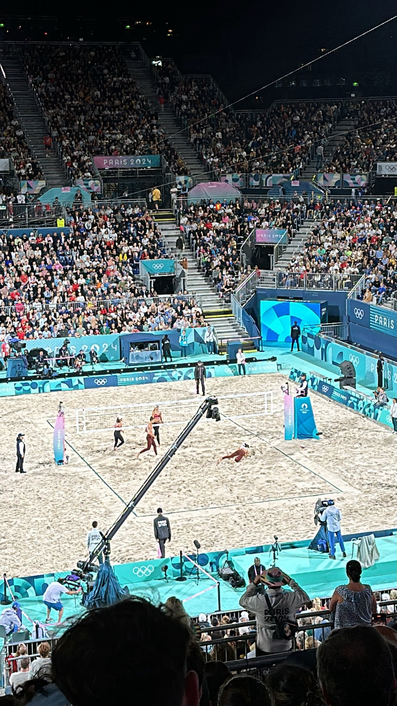
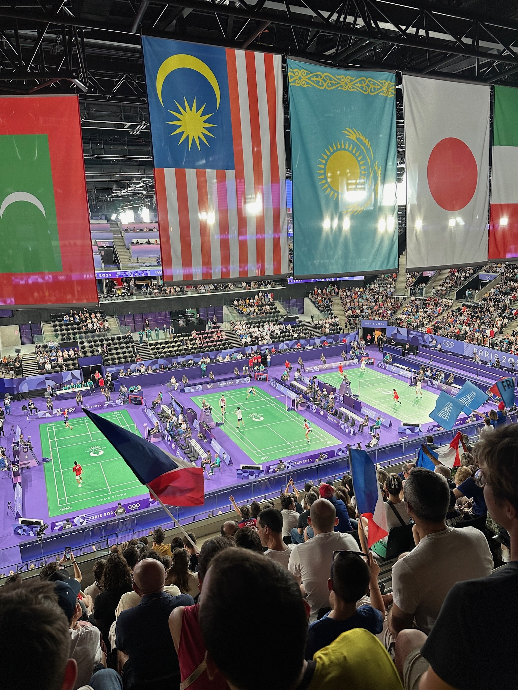
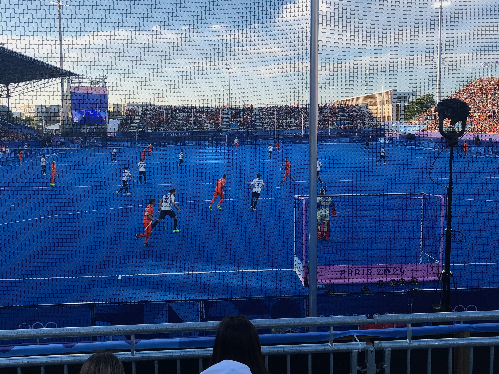

## The different moods of the Tower
> The Eiffel tower in all its glory
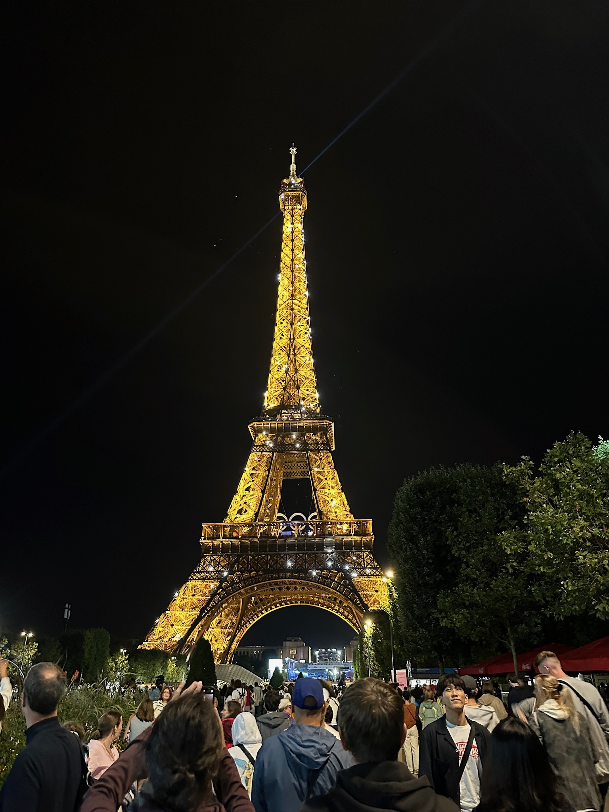
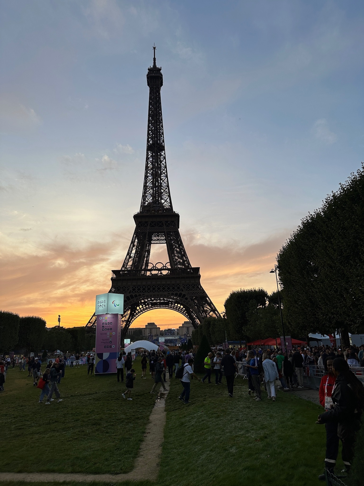

## The flying cauldron
> The cauldron does not really have fire but incorporates 40 LED spotlights to illuminate the cloud created by 200 high-pressure misting nozzles. Paris is really living up as the host of the climate agreement.
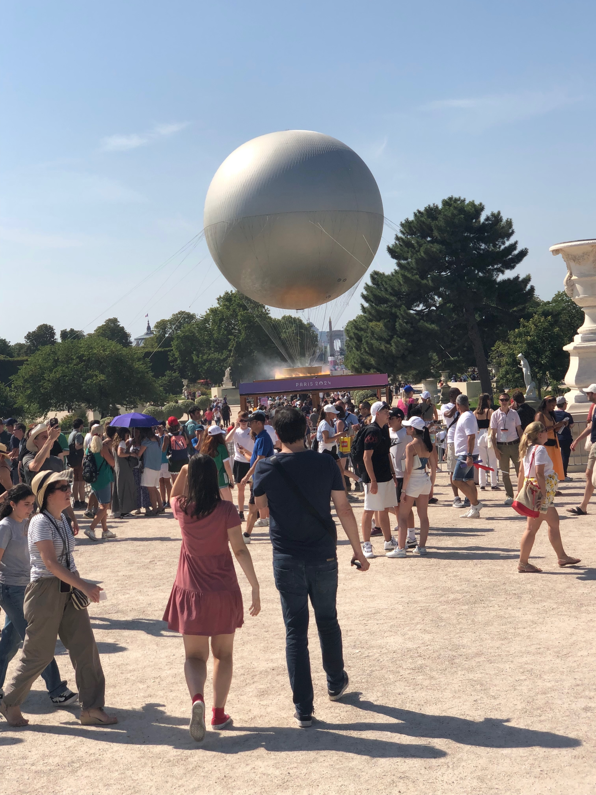
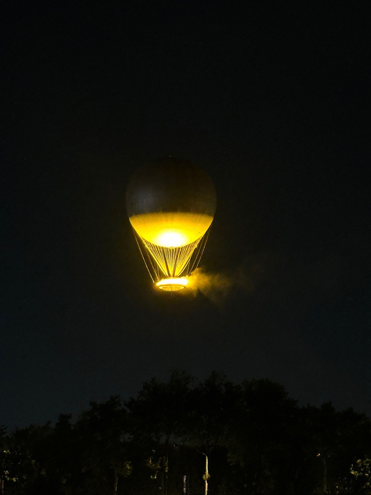

## We love french food

> Some of our favourites
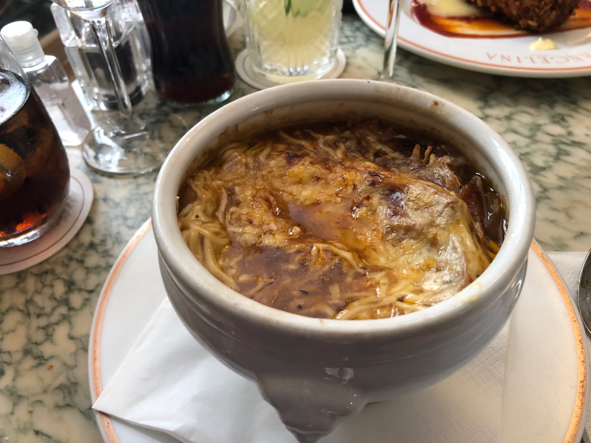
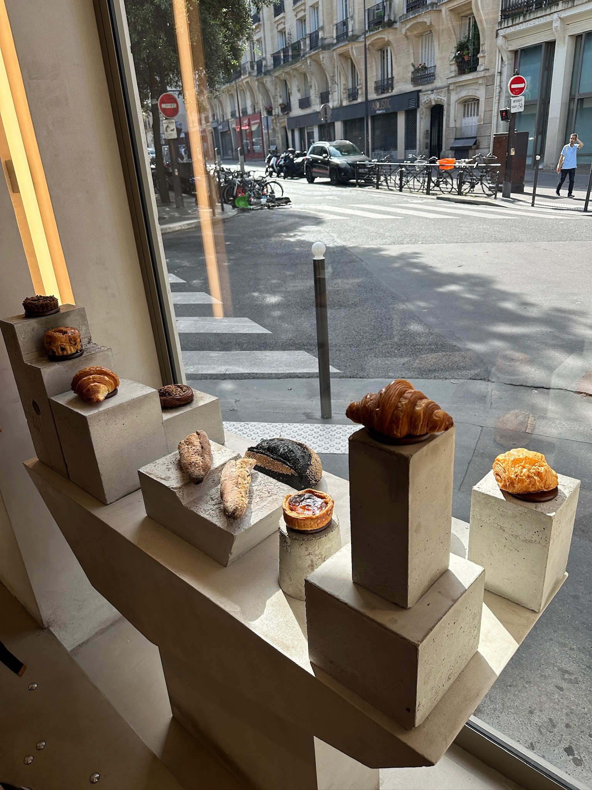

```
End of page but pls click your browser's back buttom to see more
```
