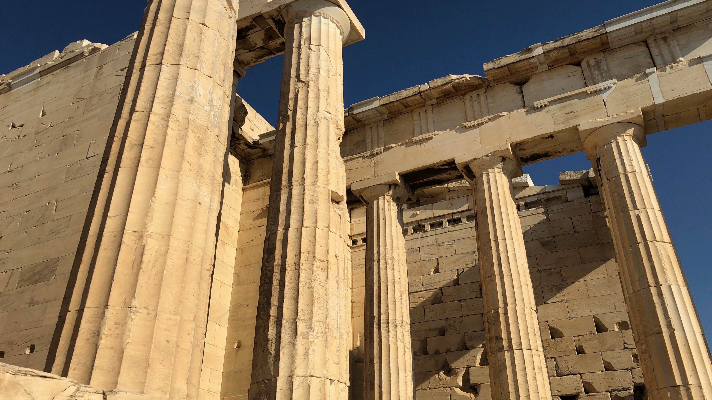
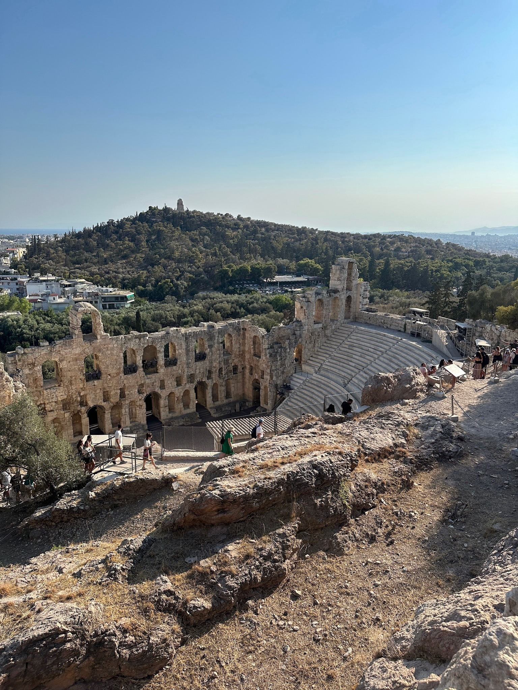
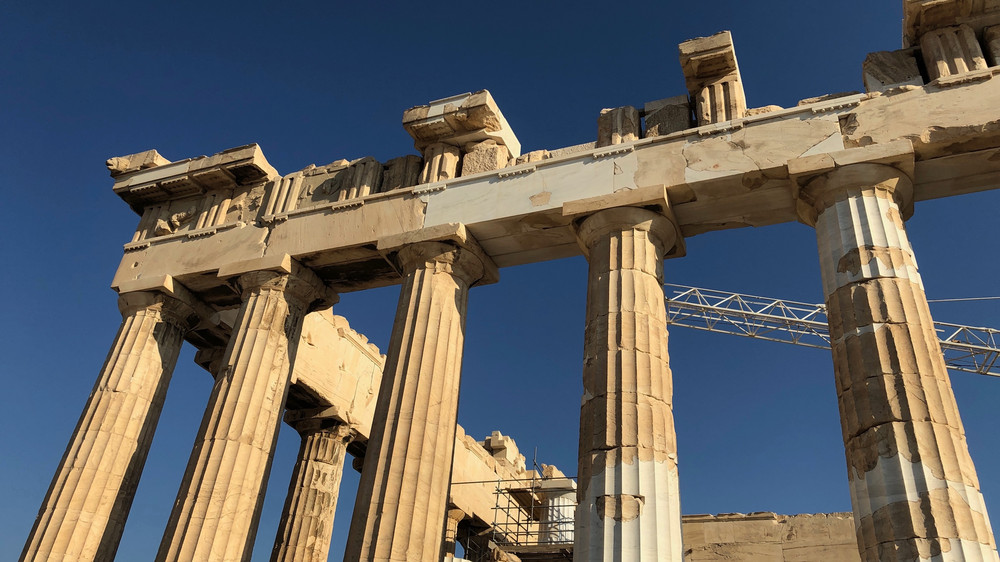
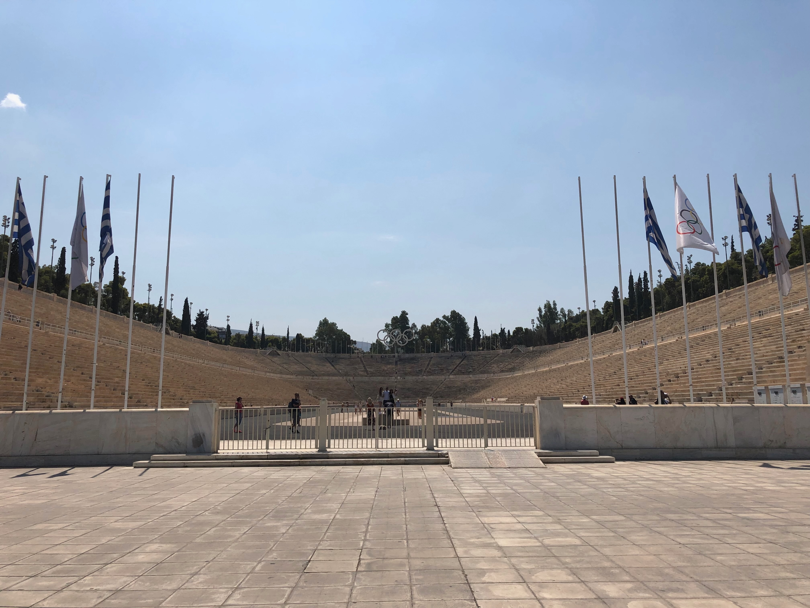
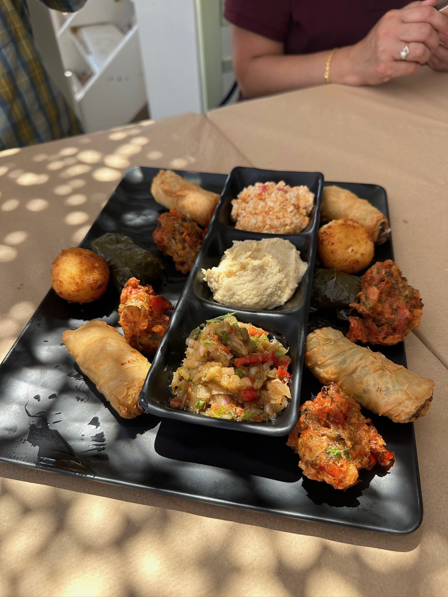
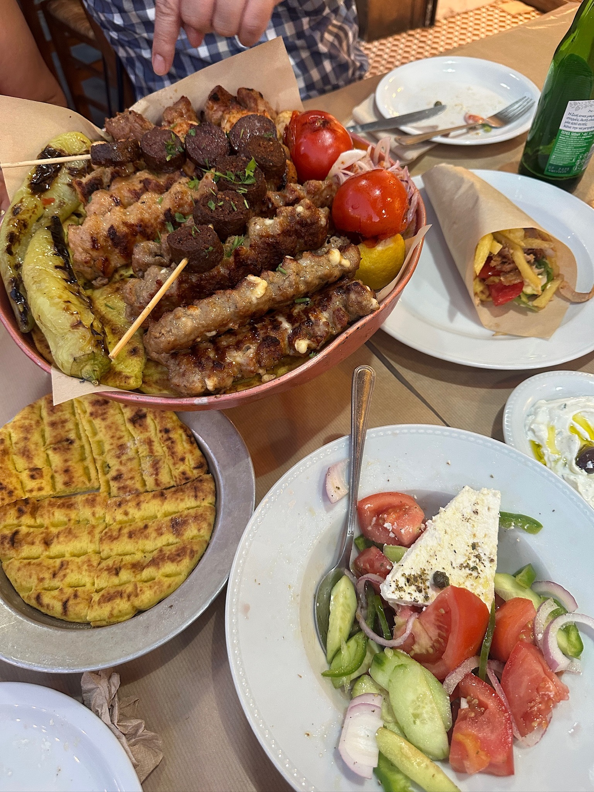

# Athens

Athens is a city rich in history and culture. Often considered the birthplace of Western civilization, it was the heart of ancient Greece, a powerful civilization and empire. The city is renowned for its ancient monuments and works of art, the most famous being the Parthenon on the Acropolis

## Parthenon on the Acropolis

The Parthenon is a magnificent marble temple located on the Acropolis and it was dedicated to Athena Parthenos, the Greek goddess of wisdom and war. The Parthenon is renowned for its Doric architecture, featuring a rectangular floor plan, a colonnade of fluted columns, and intricate sculptures and Despite enduring centuries of damage, it remains a powerful symbol of ancient Greek culture and architectural brilliance.
> TIP: A recently built museum beside the Parthenon must not be missed because it contains artefacts from acropolis.




## The Panathenaic Stadium 

This stadium hosted the opening and closing ceremonies of the first modern Olympics in 1896 and It is the finishing point for the annual Athens Classic Marathon. It is also the last venue in Greece from where the Olympic flame handover ceremony to the host nation takes place.[6][7]
> The only stadium in the world built entirely of marble.



## Greek food galore

> TIP: Not to be missed: gyros, souvlaki, dips esp. tzakiki, grilled meats, sausages & fish, and of course, greek salad.



```
End of page but pls click your browser's back buttom to see more
```
