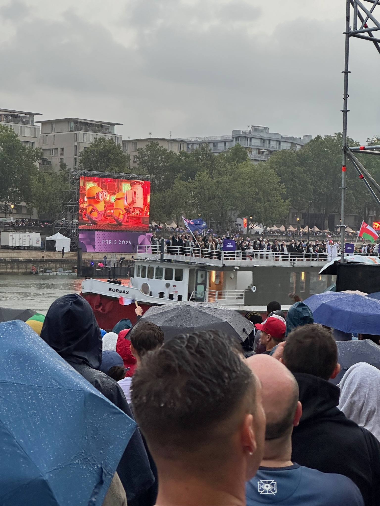

# Athens

Athens is a city rich in history and culture. Often considered the birthplace of Western civilization, it was the heart of ancient Greece, a powerful civilization and empire. The city is renowned for its ancient monuments and works of art, the most famous being the Parthenon on the Acropolis

## Parthenon on the Acropolis

What's unique with the opening ceremony is it was done along the Seine river where the athletes are on boats passing by. The problem is because of too many moving parts, the only way to maintain the script or story line is through the big screens.
> Australia & France teams passing our location where we were standing for 5 hours, wet with loud speakers & a distant big screen. It was a different kind of experience compared to Sydney 2000.



```
End of page but pls click your browser's back buttom to see more
```
