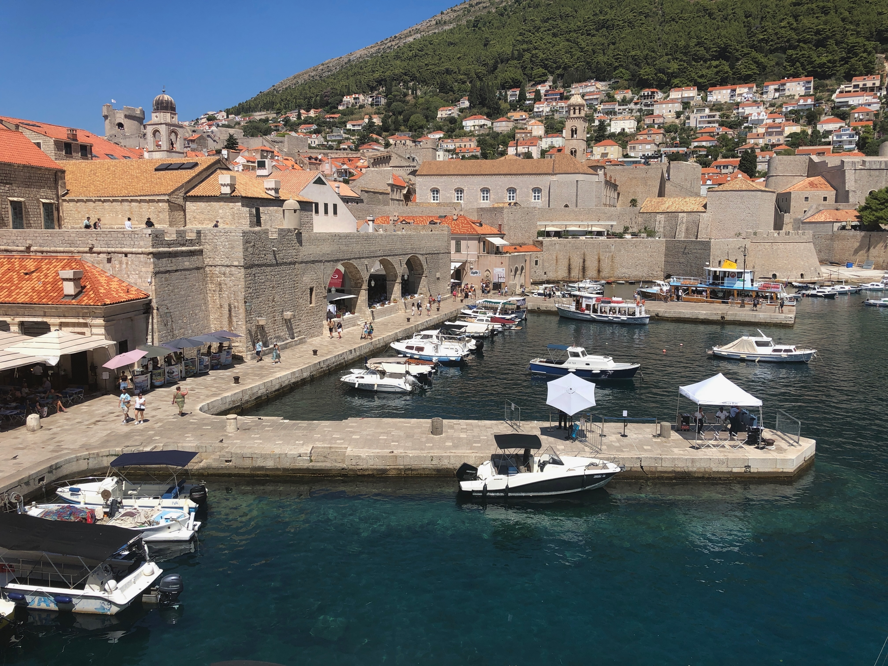

# Dubrovnik

Dubrovnik, often called the “Pearl of the Adriatic,” is a stunning city located on the southern coast of Croatia along the Adriatic Sea. Known for its well-preserved medieval architecture and fortified old town, Dubrovnik is a UNESCO World Heritage.


## The stunning old town

Dubrovnik’s old town is famous for its beautiful churches, palaces, and the impressive city walls that offer breathtaking views of the sea.
> It’s also known for being a filming location for the TV series “Game of Thrones,” where it represented the fictional city of King’s Landing. It is a "must" to walk around the wall of the city and the following photos I got shows how beautiful this place is. Note that the first photo is a map showing the walls around the city, where we walked under a 35C sun!

> Incidentally, this map also shows the bombing spots when Dubrovnik experienced a significant and tragic event known as the Siege of Dubrovnik. This was part of the Croatian War of Independence. Croatia is one of the countries that became independent when Yugoslavia broke up due to political and economic crises, along with rising ethnic tensions. Other countries are Bosnia and Herzegovina, North Macedonia, Montenegro, Serbia & Slovenia.




## The famous stairs of the "walk of shame"

> It's amazing how cinematography can transform this place during the 8 seasons of the "Game of Thrones". The king's seat decorated with swords & blades are in an island which you need to ferry to. The one that I (and other people) will always remember in this series is how bad the finale was.


## We enjoyed the very fresh seafood 

> The heat has caused me to lose my appetite but this restaurant was air conditioned so I really enjoyed it.


```
End of page
```
