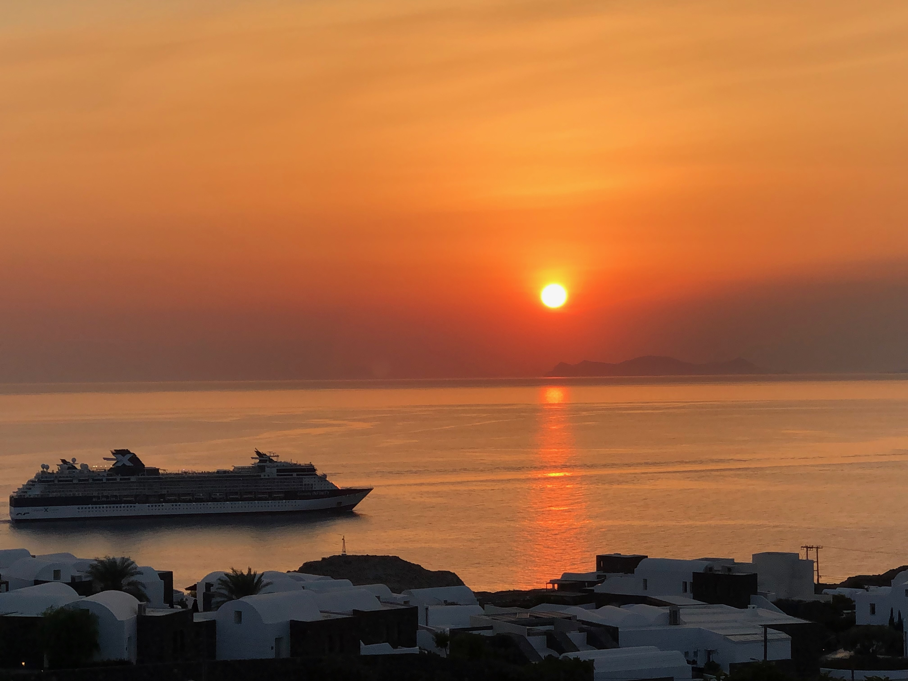
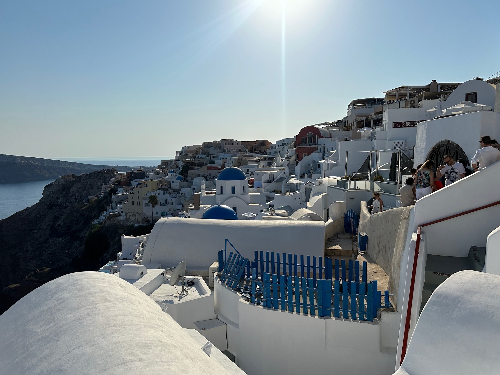
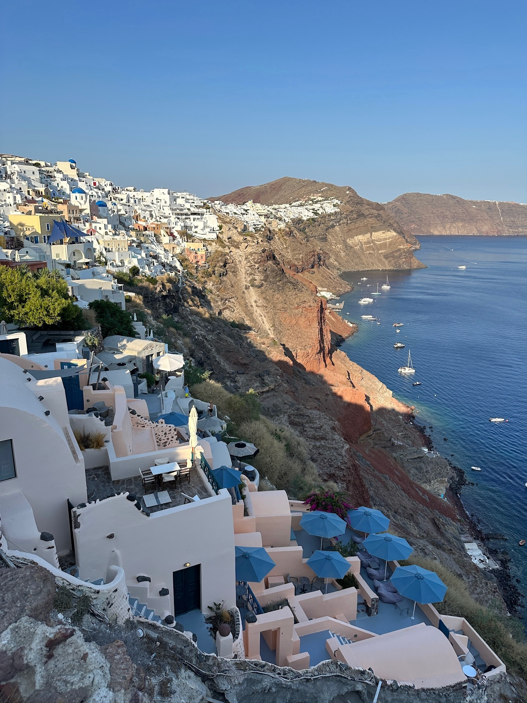

# Santorini

Santorini is a beautiful island located in the Aegean Sea, part of Greece. It's known for its stunning sunsets, white-washed buildings with blue domes, and breathtaking views of the caldera, a large volcanic crater. The island offers a mix of history, culture, and natural beauty, making it a popular destination for tourists. Visitors can explore ancient ruins, relax on unique black sand beaches, and enjoy delicious Greek cuisine. Santorini is also famous for its wine, produced from grapes grown in the island's volcanic soil. 

## Stunning sunset

My photo of a beautiful sunset and just in time for my fav cruise ship Celebrity X (I did a cruise in Scandinavia & Asia in it and  I will so do a blog soon). Santorini is full of outdoor setting clubs which showcase the sunsets and I took this from one of them. Every golden hour ie. 8:20pm for this photo,  the sunset is always different every time.
> TIP: Avoid the popular sunset lookout. Recommendation is to go to a restaurant for a few drinks before the sunset
 

## White-washed building with blue domes

Buildings are painted using limestone that is why they look pristine white. There are really not many blue domes as shown in the photos below. 
> TIP: These places with good views are always full of people during sunset so secure a place early before the sunset.



## Breathtaking views of the caldera (large volcanic crater)

1.  This is an ordered list following a header.
2.  This is an ordered list following a header.
3.  This is an ordered list following a header.


```
End of page
```
